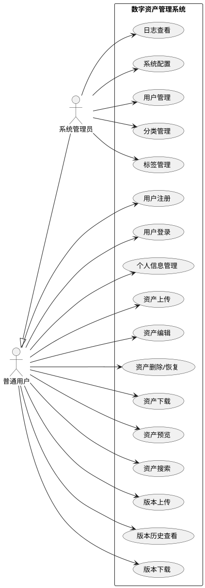
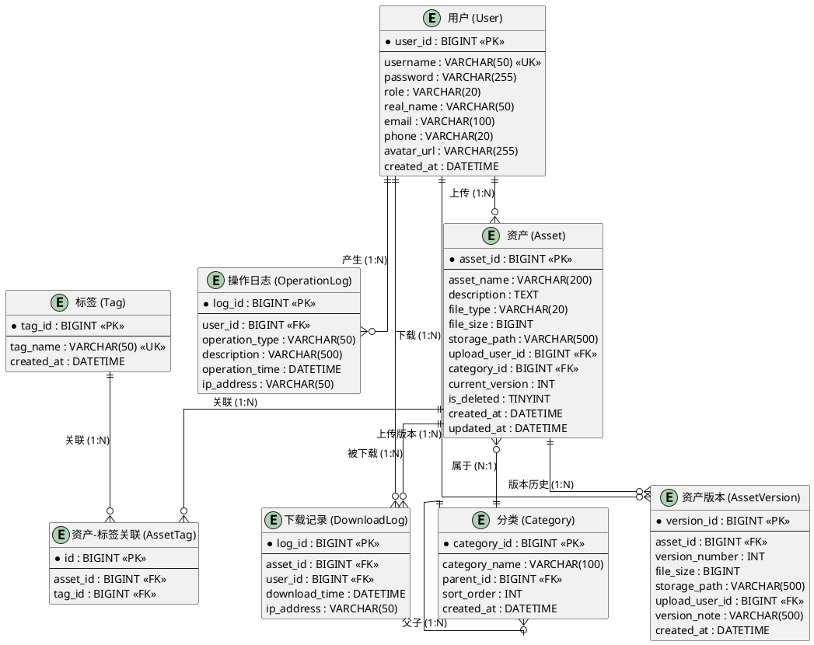
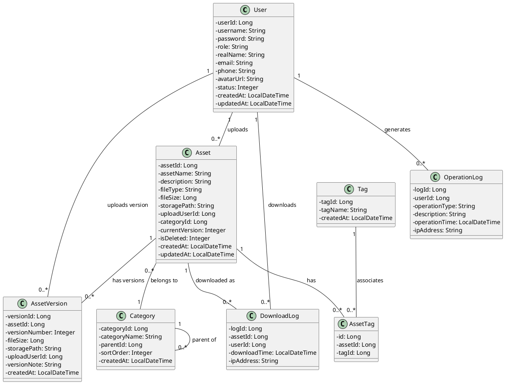

# 软件工程综合实践实训报告

**课程名称**：软件工程综合实践

**项目名称**：基于Vue+Spring Boot的数字资产管理系统的设计与实现

**专业**：计算机科学与技术

**班级**：2023级

**指导老师**：陈剑波、许文庆

**日期**：2026年6月

***

## 一、项目描述

### 1.1 项目名称

**数字资产管理系统（Digital Asset Management System）**

### 1.2 项目背景

随着企业数字化转型的深入推进，各类数字文件（文档、图片、视频、音频、设计稿等）呈爆炸式增长。传统的文件管理方式（如共享文件夹、FTP服务器）存在分类混乱、检索困难、版本管理缺失、权限控制不足等问题，严重影响了团队的工作效率。数字资产管理系统（DAM）应运而生，为企业和团队提供了一套集中存储、分类管理、版本控制和权限管控的完整解决方案。

本项目旨在开发一套轻量级、易部署的数字资产管理系统，帮助中小型团队高效管理数字资产，实现资产的规范化存储、快速检索和安全共享。

### 1.3 项目目标

1. 提供统一的数字资产上传、存储、管理平台，支持文档、图片、视频、音频等常见格式；
2. 实现灵活的资产分类与标签体系，支持多维度组织和筛选；
3. 实现资产版本控制，保留历史版本并支持回退；
4. 提供全文搜索与多条件组合筛选功能，提升资产检索效率；
5. 实现基于角色的权限控制，确保资产安全；
6. 遵循软件工程规范，完成从需求分析到测试的完整开发流程文档。

### 1.4 项目范围

本系统包含以下核心范围：

* **用户管理**：注册、登录、角色权限控制、个人信息维护；

* **资产管理**：资产上传、编辑、删除（逻辑删除/回收站）、下载、预览；

* **分类管理**：树形分类结构的增删改查；

* **标签管理**：标签的增删改查及多标签关联；

* **搜索检索**：关键词模糊搜索、分类/标签/类型组合筛选；

* **版本控制**：版本上传、历史查看、版本回退与下载；

* **系统管理**：操作日志、下载记录、系统配置。

系统不包含的范围：在线协同编辑、AI智能分类、第三方云存储集成、移动端APP。

***

## 二、设计环境及工具

### 2.1 硬件环境

| 类别  | 最低配置                            | 推荐配置                             |
| --- | ------------------------------- | -------------------------------- |
| CPU | Intel Core i5 第8代 / AMD Ryzen 5 | Intel Core i7 第11代 / AMD Ryzen 7 |
| 内存  | 8 GB                            | 16 GB                            |
| 硬盘  | 256 GB SSD                      | 512 GB SSD                       |
| 网络  | 宽带网络                            | 宽带网络                             |

### 2.2 软件环境

| 类别      | 软件/工具                      | 版本     | 用途         |
| ------- | -------------------------- | ------ | ---------- |
| 操作系统    | Windows 10/11              | 21H2+  | 开发与运行环境    |
| 开发语言    | Java                       | JDK 17 | 后端开发       |
| 开发语言    | JavaScript/Vue 3           | —      | 前端开发       |
| 后端框架    | Spring Boot                | 3.x    | 后端应用框架     |
| ORM框架   | MyBatis-Plus               | 3.5.x  | 数据持久层      |
| 前端框架    | Vue 3                      | 3.4+   | 前端UI框架     |
| UI组件库   | Element Plus               | 2.6+   | 前端组件库      |
| 数据库     | MySQL                      | 8.0+   | 关系型数据存储    |
| 文件存储    | MinIO / 本地文件系统             | —      | 文件物理存储     |
| 构建工具    | Maven                      | 3.9+   | 后端依赖管理与构建  |
| 构建工具    | Vite                       | 5.x    | 前端构建工具     |
| 版本控制    | Git + GitHub               | —      | 代码版本管理     |
| IDE     | IntelliJ IDEA / VS Code    | 2024+  | 集成开发环境     |
| API调试   | Postman / Swagger(Knife4j) | —      | 接口测试与文档    |
| 原型设计    | Axure RP / Figma / 墨刀      | —      | 界面原型设计     |
| UML建模   | Draw\.io / PlantUML        | —      | 用例图、类图、时序图 |
| 流程图     | Draw\.io / ProcessOn       | —      | 业务流程图、判定表  |
| 单元测试    | JUnit 5                    | 5.10+  | 后端单元测试     |
| HTTP客户端 | Axios                      | 1.6+   | 前端HTTP请求   |

### 2.3 开发环境配置说明

**后端项目结构**（Spring Boot + Maven）：

```
asset-management-backend/
├── src/main/java/com/dam/
│   ├── controller/        # 控制器层
│   ├── service/           # 业务逻辑层
│   │   └── impl/          # 业务逻辑实现
│   ├── mapper/            # 数据访问层
│   ├── entity/            # 实体类
│   ├── dto/               # 数据传输对象
│   ├── vo/                # 视图对象
│   ├── config/            # 配置类
│   ├── util/              # 工具类
│   └── common/            # 通用类（统一返回、异常处理）
├── src/main/resources/
│   ├── application.yml    # 主配置文件
│   └── mapper/            # MyBatis XML映射文件
└── pom.xml                # Maven依赖配置
```

**前端项目结构**（Vue 3 + Vite）：

```
asset-management-frontend/
├── src/
│   ├── views/             # 页面视图组件
│   ├── components/        # 公共组件
│   ├── router/            # 路由配置
│   ├── store/             # 状态管理（Pinia）
│   ├── api/               # API请求封装
│   ├── utils/             # 工具函数
│   └── assets/            # 静态资源
├── package.json
└── vite.config.js
```

***

## 三、软件工程文档

***

### 1. 系统可行性分析报告（XXX完成）

***

#### 1.1 项目要求

##### 1.1.1 功能要求

数字资产管理系统需要满足以下功能要求：

1. **用户管理**

   * 支持用户注册与登录，密码加密存储；

   * 区分系统管理员与普通用户两种角色；

   * 管理员可查看和管理所有用户；

   * 用户可维护个人基本信息。

2. **资产管理**

   * 支持上传文档、图片、视频、音频等常见格式文件；

   * 提供资产基本信息编辑（名称、描述、分类、标签）；

   * 支持逻辑删除（移入回收站）与彻底删除；

   * 支持文件下载并记录下载日志；

   * 限制单文件上传大小为10MB，防止服务器负载过高。

3. **分类与标签管理**

   * 支持多级树形分类结构，可灵活增删改查；

   * 支持标签的增删改查，资产可关联多个标签；

   * 可按分类或标签快速筛选资产。

4. **搜索与筛选**

   * 支持按资产名称模糊搜索；

   * 支持按分类、标签、文件类型、时间范围组合筛选；

   * 搜索结果分页展示。

5. **版本控制**

   * 支持为同一资产上传新版本；

   * 可查看版本历史记录；

   * 支持下载历史版本。

6. **系统管理**

   * 记录用户操作日志；

   * 记录资产下载日志；

   * 支持系统基本配置。

##### 1.1.2 非功能要求

1. **安全性**：

   * 密码采用BCrypt加密存储；

   * 使用JWT Token进行身份认证；

   * 文件上传校验文件类型魔数；

   * 防止SQL注入与XSS攻击。

2. **性能**：

   * 普通查询响应时间不超过2秒；

   * 支持至少50个并发用户；

   * 分页查询每页数据量不超过20条。

3. **易用性**：

   * 界面简洁直观，符合主流管理系统的交互规范；

   * 提供操作反馈（成功提示、错误提示、加载状态）。

##### 1.1.3 约束条件

* 团队规模不超过3人；

* 开发周期为1周（7天）；

* 使用Java作为后端语言，Vue作为前端框架；

* 使用MySQL作为数据库。

***

#### 1.2 项目介绍

##### 1.2.1 项目概述

数字资产管理系统是一个基于B/S架构的Web应用，采用前后端分离的设计模式。系统面向中小型团队，提供数字资产的全生命周期管理功能，涵盖资产的上传、分类、标签、搜索、版本控制和下载等环节。

##### 1.2.2 用户角色分析

| 角色        | 职责描述   | 核心权限                            |
| --------- | ------ | ------------------------------- |
| **系统管理员** | 系统全局管理 | 用户管理、资产管理、分类管理、标签管理、日志查看、系统配置   |
| **普通用户**  | 日常资产操作 | 资产上传/编辑/删除/下载、分类浏览、标签使用、搜索、版本管理 |

##### 1.2.3 业务流程概览

```
                    ┌─────────────┐
                    │   用户登录   │
                    └──────┬──────┘
                           │
              ┌────────────┼────────────┐
              │            │            │
         ┌────▼───┐   ┌───▼────┐   ┌──▼──────┐
         │资产管理 │   │分类标签 │   │系统管理  │
         └────┬───┘   └───┬────┘   └──┬──────┘
              │            │            │
    ┌─────┴─────┐     ┌───┴───┐    ┌───┴───┐
    │ 上传 编辑  │     │分类树  │    │用户管理│
    │ 下载 删除  │     │标签管理 │    │日志配置│
    │ 搜索 版本  │     └───────┘    └───────┘
    └───────────┘
```

##### 1.2.4 技术可行性

本系统采用的技术栈（Spring Boot + Vue 3 + MySQL）均为业界成熟的开源技术，社区活跃、文档丰富。团队成员在课程中已学习Java Web开发和数据库相关知识，具备基本开发能力。项目功能边界清晰，复杂度适中，在一周内完成核心功能具备可行性。

##### 1.2.5 经济可行性

本系统全部使用开源免费技术，无需购买商业授权。开发工具（IDE、数据库客户端等）均有免费版本可用，项目总成本接近于零。

##### 1.2.6 操作可行性

系统采用Web界面，用户只需浏览器即可访问，无需安装客户端。界面设计遵循主流管理系统的交互范式，用户学习成本低。

##### 1.2.7 团队分工

| 成员      | 角色          | 主要职责                            |
| ------- | ----------- | ------------------------------- |
| XXX（组长） | 项目经理 + 后端开发 | 项目计划、概要设计、数据库设计、用户模块+资产管理模块后端编码 |
| XXX（组员） | 前端开发 + UI设计 | 界面原型设计、前端编码、详细设计文档              |
| XXX（组员） | 测试 + 文档     | 需求分析文档、测试文档、集成测试、文档整合排版         |

***

#### 1.3 功能需求分析

##### 1.3.1 用例图

系统用例图如下所示（使用PlantUML描述）：



##### 1.3.2 功能需求详述

**FR-01 用户注册**

| 项目 | 说明                                |
| -- | --------------------------------- |
| 描述 | 新用户通过注册页面创建账号                     |
| 输入 | 用户名、密码、确认密码、姓名、邮箱                 |
| 处理 | 校验用户名唯一性、密码复杂度、邮箱格式；密码BCrypt加密后存储 |
| 输出 | 注册成功，跳转登录页；注册失败，显示错误信息            |
| 约束 | 用户名4-20字符，密码6-20字符且包含字母和数字        |

**FR-02 用户登录**

| 项目 | 说明                                |
| -- | --------------------------------- |
| 描述 | 用户输入凭证登录系统                        |
| 输入 | 用户名、密码                            |
| 处理 | 验证用户名和密码；生成JWT Token并返回           |
| 输出 | 登录成功，跳转首页，Token存储到浏览器localStorage |
| 约束 | Token有效期24小时                      |

**FR-03 资产上传**

| 项目 | 说明                                                                      |
| -- | ----------------------------------------------------------------------- |
| 描述 | 用户上传数字资产文件                                                              |
| 输入 | 文件、资产名称、分类、标签、描述                                                        |
| 处理 | 校验文件类型（魔数校验）和大小（≤10MB）；UUID重命名存储；保存元数据到数据库                              |
| 输出 | 上传成功，资产出现在列表中                                                           |
| 约束 | 允许格式：PDF/DOC/DOCX/XLS/XLSX/PPT/PPTX/TXT/JPG/PNG/GIF/SVG/MP4/MP3/WAV/ZIP |

**FR-04 资产搜索**

| 项目 | 说明                        |
| -- | ------------------------- |
| 描述 | 用户搜索和筛选资产                 |
| 输入 | 关键词、分类ID、标签ID列表、文件类型、时间范围 |
| 处理 | 构建多条件SQL查询；支持模糊匹配和精确匹配    |
| 输出 | 分页的资产列表                   |
| 约束 | 支持空搜索（列出全部）；默认按上传时间倒序     |

**FR-05 版本管理**

| 项目 | 说明                                |
| -- | --------------------------------- |
| 描述 | 为已有资产上传新版本                        |
| 输入 | 新文件、版本说明                          |
| 处理 | 保存新版本文件；旧版本文件保留；版本号自动递增；更新资产当前版本号 |
| 输出 | 版本上传成功，版本历史新增一条记录                 |
| 约束 | 新文件类型需与原资产类型一致或兼容                 |

##### 1.3.3 数据需求（E-R图）

系统E-R图如下所示：



***

#### 1.4 业务功能点设计、分析（业务流程）

##### 1.4.1 资产上传流程

```
开始
  │
  ▼
用户选择文件
  │
  ▼
前端校验 ──→ 失败 ──→ 提示错误信息
  │（文件类型/大小）
  │成功
  ▼
用户填写资产元数据（名称、分类、标签、描述）
  │
  ▼
提交上传请求
  │
  ▼
后端校验 ──→ 失败 ──→ 返回错误信息
  │（文件魔数/大小/用户权限）
  │成功
  ▼
UUID重命名文件
  │
  ▼
保存文件到存储目录
  │
  ▼
保存元数据到数据库
  │
  ▼
记录操作日志
  │
  ▼
返回成功响应
  │
  ▼
结束
```

##### 1.4.2 资产搜索流程

```
开始
  │
  ▼
用户输入搜索条件
（关键词/分类/标签/类型/时间）
  │
  ▼
提交搜索请求
  │
  ▼
后端构建动态SQL查询
  ├── 关键词 → WHERE asset_name LIKE '%keyword%'
  ├── 分类   → WHERE category_id = ?
  ├── 标签   → JOIN asset_tag WHERE tag_id IN (...)
  ├── 类型   → WHERE file_type = ?
  └── 时间   → WHERE created_at BETWEEN ? AND ?
  │
  ▼
执行分页查询
  │
  ▼
返回分页结果
  │
  ▼
前端渲染搜索结果
  │
  ▼
结束
```

##### 1.4.3 资产版本管理流程

```
开始
  │
  ▼
用户选择已存在的资产
  │
  ▼
点击"上传新版本"
  │
  ▼
选择新文件并填写版本说明
  │
  ▼
提交版本上传请求
  │
  ▼
后端校验文件 ──→ 失败 ──→ 返回错误
  │成功
  ▼
保存新版本文件
  │
  ▼
新增AssetVersion记录
（版本号 = 当前最大版本号 + 1）
  │
  ▼
更新Asset表的current_version字段
  │
  ▼
记录操作日志
  │
  ▼
返回成功
  │
  ▼
结束
```

##### 1.4.4 资产删除与恢复流程

```
开始
  │
  ▼
用户选择资产，点击"删除"
  │
  ▼
确认删除对话框
  │
  ▼
逻辑删除：设置 is_deleted = 1
  │
  ▼
资产从主列表移除，进入回收站
  │
  ▼
用户可在回收站执行：
  ├── 恢复：设置 is_deleted = 0 ──→ 资产回到主列表
  └── 彻底删除：删除数据库记录 + 删除物理文件
  │
  ▼
结束
```

##### 1.4.5 用户注册与登录流程

```
        用户注册                         用户登录
          │                               │
          ▼                               ▼
   填写注册信息                      输入用户名密码
          │                               │
          ▼                               ▼
   前端校验格式                      提交登录请求
          │                               │
          ▼                               ▼
   提交注册请求                后端查询用户并验证密码(BCrypt)
          │                               │
          ├─ 用户名已存在 ──→ 失败        ├─ 验证通过
          │                               │   │
          ▼                               │   ▼
   密码BCrypt加密存储                 生成JWT Token
          │                               │
          ▼                               ▼
   保存用户记录                      返回Token + 用户信息
          │                               │
          ▼                               ▼
   注册成功，跳转登录                    前端存储Token
                                          │
                                          ▼
                                   跳转系统首页
```

***

### 2. 概要设计（XXX完成）

***

#### 2.1 概要设计说明书

##### 2.1.1 系统架构设计

本系统采用B/S三层架构（表现层、业务逻辑层、数据访问层），结合前后端分离的架构模式：

```
┌─────────────────────────────────────────────────────┐
│                     前端 (Vue 3)                     │
│  ┌─────────┐ ┌──────────┐ ┌─────────┐ ┌─────────┐ │
│  │  路由    │ │  组件库   │ │ 状态管理 │ │ 工具库  │ │
│  │ Router  │ │ Element+ │ │  Pinia  │ │  Axios  │ │
│  └─────────┘ └──────────┘ └─────────┘ └─────────┘ │
└─────────────────────┬───────────────────────────────┘
                      │ HTTP/REST API (JSON)
                      ▼
┌─────────────────────────────────────────────────────┐
│                   后端 (Spring Boot)                 │
│  ┌─────────────────────────────────────────────┐   │
│  │              Controller 层                    │   │
│  │  (接收请求、参数校验、返回响应)                │   │
│  └─────────────────────┬───────────────────────┘   │
│                        ▼                             │
│  ┌─────────────────────────────────────────────┐   │
│  │              Service 层                       │   │
│  │  (业务逻辑处理、事务管理)                      │   │
│  └─────────────────────┬───────────────────────┘   │
│                        ▼                             │
│  ┌─────────────────────────────────────────────┐   │
│  │              Mapper 层 (MyBatis-Plus)         │   │
│  │  (数据库访问)                                  │   │
│  └─────────────────────┬───────────────────────┘   │
└────────────────────────┼────────────────────────────┘
                         ▼
              ┌─────────────────────┐
              │    MySQL 8.0        │
              │   + 文件存储系统     │
              └─────────────────────┘
```

##### 2.1.2 技术架构说明

| 层次   | 技术                           | 说明                 |
| ---- | ---------------------------- | ------------------ |
| 表现层  | Vue 3 + Element Plus + Axios | SPA单页应用，组件化开发      |
| 网关层  | Nginx（部署时）                   | 反向代理、静态资源服务        |
| 控制器层 | Spring Boot MVC              | RESTful API，统一返回格式 |
| 业务层  | Spring Service + 事务注解        | 业务逻辑封装，声明式事务       |
| 数据层  | MyBatis-Plus + MySQL         | ORM映射，简化CRUD       |
| 安全层  | Spring Security + JWT        | 认证授权               |
| 文件层  | MinIO / 本地文件系统               | 文件存储与读取            |

##### 2.1.3 接口设计规范

**统一返回格式**：

```json
{
  "code": 200,
  "message": "操作成功",
  "data": {},
  "timestamp": 1716547200000
}
```

**状态码定义**：

| 状态码 | 含义          |
| --- | ----------- |
| 200 | 操作成功        |
| 400 | 请求参数有误      |
| 401 | 未认证/Token过期 |
| 403 | 无权限         |
| 404 | 资源不存在       |
| 500 | 服务器内部错误     |

##### 2.1.4 关键API接口列表

| 方法     | 路径                        | 描述       | 权限   |
| ------ | ------------------------- | -------- | ---- |
| POST   | /api/user/register        | 用户注册     | 公开   |
| POST   | /api/user/login           | 用户登录     | 公开   |
| GET    | /api/user/profile         | 获取个人信息   | 登录用户 |
| PUT    | /api/user/profile         | 修改个人信息   | 登录用户 |
| GET    | /api/user/list            | 用户列表     | 管理员  |
| POST   | /api/asset/upload         | 上传资产     | 登录用户 |
| GET    | /api/asset/list           | 资产列表（分页） | 登录用户 |
| GET    | /api/asset/{id}           | 资产详情     | 登录用户 |
| PUT    | /api/asset/{id}           | 修改资产     | 登录用户 |
| DELETE | /api/asset/{id}           | 逻辑删除资产   | 登录用户 |
| GET    | /api/asset/{id}/download  | 下载资产     | 登录用户 |
| POST   | /api/asset/{id}/version   | 上传新版本    | 登录用户 |
| GET    | /api/asset/{id}/versions  | 版本历史     | 登录用户 |
| GET    | /api/asset/recycle        | 回收站列表    | 登录用户 |
| PUT    | /api/asset/{id}/restore   | 恢复资产     | 登录用户 |
| DELETE | /api/asset/{id}/permanent | 彻底删除     | 登录用户 |
| GET    | /api/category/tree        | 分类树      | 登录用户 |
| POST   | /api/category             | 新增分类     | 管理员  |
| PUT    | /api/category/{id}        | 修改分类     | 管理员  |
| DELETE | /api/category/{id}        | 删除分类     | 管理员  |
| GET    | /api/tag/list             | 标签列表     | 登录用户 |
| POST   | /api/tag                  | 新增标签     | 登录用户 |
| DELETE | /api/tag/{id}             | 删除标签     | 管理员  |
| GET    | /api/search               | 搜索资产     | 登录用户 |
| GET    | /api/log/operation        | 操作日志     | 管理员  |
| GET    | /api/log/download         | 下载记录     | 管理员  |

***

#### 2.2 界面设计

##### 2.2.1 界面设计原则

1. **简洁直观**：减少不必要的装饰元素，突出核心功能区域；
2. **一致性**：色彩、字体、间距、交互方式保持统一；
3. **响应式布局**：适配1366×768及以上分辨率的主流屏幕；
4. **操作反馈**：所有操作提供明确的成功/失败/加载状态反馈。

##### 2.2.2 核心界面原型设计

以下为核心界面的原型设计描述（建议使用Axure/Figma/Mockplus等工具制作高保真原型，此处以文字+草图方式描述）：

**(1) 登录页面**

```
┌──────────────────────────────────────────────────┐
│                                                  │
│                                                  │
│         ┌──────────────────────────┐             │
│         │    数字资产管理系统       │             │
│         │       D A M              │             │
│         │                          │             │
│         │  ┌────────────────────┐  │             │
│         │  │  用户名            │  │             │
│         │  └────────────────────┘  │             │
│         │  ┌────────────────────┐  │             │
│         │  │  密码              │  │             │
│         │  └────────────────────┘  │             │
│         │  ┌────────────────────┐  │             │
│         │  │      登  录        │  │             │
│         │  └────────────────────┘  │             │
│         │  还没有账号？立即注册     │             │
│         └──────────────────────────┘             │
│                                                  │
└──────────────────────────────────────────────────┘
```

**(2) 系统首页/仪表盘**

```
┌──────────────────────────────────────────────────┐
│ LOGO   资产管理  分类标签  系统管理   [用户] [退出] │
├──────────┬───────────────────────────────────────┤
│          │                                       │
│  侧边栏  │   ┌──────┐ ┌──────┐ ┌──────┐ ┌──────┐│
│          │   │资产总 │ │文档数 │ │图片数 │ │视频数 ││
│  资产列表│   │ 128  │ │  45  │ │  60  │ │  15  ││
│  回收站  │   └──────┘ └──────┘ └──────┘ └──────┘│
│  分类管理│                                       │
│  标签管理│   ┌────────────────────────────────┐  │
│  操作日志│   │  最近上传的资产                  │  │
│          │   │  ┌───┐ ┌───┐ ┌───┐ ┌───┐     │  │
│          │   │  │   │ │   │ │   │ │   │     │  │
│          │   │  └───┘ └───┘ └───┘ └───┘     │  │
│          │   └────────────────────────────────┘  │
│          │                                       │
└──────────┴───────────────────────────────────────┘
```

**(3) 资产列表页（网格视图）**

```
┌──────────────────────────────────────────────────┐
│ [上传资产] [切换视图]  搜索: [____] [分类▼] [类型▼]│
├──────────────────────────────────────────────────┤
│                                                  │
│  ┌────────┐ ┌────────┐ ┌────────┐ ┌────────┐   │
│  │ 缩略图  │ │ 缩略图  │ │ 缩略图  │ │ 缩略图  │   │
│  │        │ │        │ │        │ │        │   │
│  │ 名称   │ │ 名称   │ │ 名称   │ │ 名称   │   │
│  │ PDF 2M │ │ JPG 1M │ │ MP4 8M │ │ DOC 500K│  │
│  └────────┘ └────────┘ └────────┘ └────────┘   │
│  ┌────────┐ ┌────────┐ ┌────────┐ ┌────────┐   │
│  │ 缩略图  │ │ 缩略图  │ │ 缩略图  │ │ 缩略图  │   │
│  │        │ │        │ │        │ │        │   │
│  │ 名称   │ │ 名称   │ │ 名称   │ │ 名称   │   │
│  │ XLS 3M │ │ PNG 2M │ │ MP3 4M │ │ ZIP 6M │   │
│  └────────┘ └────────┘ └────────┘ └────────┘   │
│                                                  │
│      ◀ 上一页    第 1/6 页    下一页 ▶           │
└──────────────────────────────────────────────────┘
```

**(4) 资产上传页**

```
┌──────────────────────────────────────────────────┐
│ 上传资产                                          │
├──────────────────────────────────────────────────┤
│                                                  │
│  ┌─────────────────────────────────────────────┐ │
│  │                                             │ │
│  │         📤  点击上传或拖拽文件到此处          │ │
│  │                                             │ │
│  │     支持：PDF/DOC/JPG/PNG/MP4等  最大10MB   │ │
│  │                                             │ │
│  └─────────────────────────────────────────────┘ │
│                                                  │
│  资产名称：[___________________________]          │
│                                                  │
│  所属分类：[请选择分类 ▼]                         │
│                                                  │
│  标签：    [标签1 ×] [标签2 ×] [添加标签 ▼]       │
│                                                  │
│  描述：    ┌─────────────────────────────┐       │
│            │                             │       │
│            └─────────────────────────────┘       │
│                                                  │
│            [取消]          [确认上传]             │
└──────────────────────────────────────────────────┘
```

**(5) 资产详情页**

```
┌──────────────────────────────────────────────────┐
│ 资产详情                               [× 关闭]  │
├──────────────────────────────────────────────────┤
│                                                  │
│  ┌────────────────────┐                         │
│  │                    │  资产名称：项目需求文档  │
│  │     文件预览       │  文件类型：PDF          │
│  │     (PDF预览)      │  文件大小：2.3 MB       │
│  │                    │  所属分类：项目文档/需求  │
│  │                    │  标签：[项目A] [V1.0]    │
│  │                    │  当前版本：v3           │
│  │                    │  上传时间：2026-06-15    │
│  │                    │  上传者：张三            │
│  │                    │                         │
│  │                    │  [下载] [上传新版本]     │
│  │                    │  [编辑] [删除]           │
│  └────────────────────┘  描述：xxxxxxxxxxxxxxx   │
│                                                  │
│  版本历史：                                      │
│  ┌──────────────────────────────────────────────┐│
│  │ v3  2026-06-15  张三  修复评审意见  [下载]   ││
│  │ v2  2026-06-12  张三  增加非功能需求  [下载] ││
│  │ v1  2026-06-10  张三  初始版本      [下载]   ││
│  └──────────────────────────────────────────────┘│
└──────────────────────────────────────────────────┘
```

**(6) 分类管理页**

```
┌──────────────────────────────────────────────────┐
│ 分类管理                           [+ 新增根分类] │
├──────────────────────────────────────────────────┤
│                                                  │
│  ┌─────────────────────────────────┐            │
│  │ 📁 全部资产                     │            │
│  │   ├─ 📁 项目文档         [+][✏][🗑]│           │
│  │   │   ├─ 📁 需求文档     [+][✏][🗑]│          │
│  │   │   ├─ 📁 设计文档     [+][✏][🗑]│          │
│  │   │   └─ 📁 测试文档     [+][✏][🗑]│          │
│  │   ├─ 📁 设计资源         [+][✏][🗑]│           │
│  │   │   ├─ 📁 UI设计稿    [+][✏][🗑]│          │
│  │   │   └─ 📁 图标素材    [+][✏][🗑]│          │
│  │   ├─ 📁 培训视频         [+][✏][🗑]│           │
│  │   └─ 📁 规章制度         [+][✏][🗑]│           │
│  └─────────────────────────────────┘            │
│                                                  │
└──────────────────────────────────────────────────┘
```

**(7) 标签管理页**

```
┌──────────────────────────────────────────────────┐
│ 标签管理                              [+ 新增标签] │
├──────────────────────────────────────────────────┤
│                                                  │
│  ┌─────────┐ ┌─────────┐ ┌─────────┐            │
│  │ 重要    ✕ │ │ 紧急    ✕ │ │ 项目A   ✕ │            │
│  └─────────┘ └─────────┘ └─────────┘            │
│  ┌─────────┐ ┌─────────┐ ┌─────────┐            │
│  │ 项目B   ✕ │ │ V1.0   ✕ │ │ 设计稿  ✕ │            │
│  └─────────┘ └─────────┘ └─────────┘            │
│  ┌─────────┐ ┌─────────┐ ┌─────────┐            │
│  │ 文档    ✕ │ │ 视频    ✕ │ │ 归档    ✕ │            │
│  └─────────┘ └─────────┘ └─────────┘            │
│                                                  │
└──────────────────────────────────────────────────┘
```

***

#### 2.3 模块设计

##### 2.3.1 系统模块结构图

```
数字资产管理系统（DAM）
│
├── 用户管理模块 (user)
│   ├── UserController          — 用户控制器
│   ├── UserService/Impl        — 用户业务逻辑
│   ├── UserMapper              — 用户数据访问
│   ├── RegisterDTO/LoginDTO    — 数据传输对象
│   ├── UserVO                  — 用户视图对象
│   └── JwtUtil                 — JWT工具类
│
├── 资产管理模块 (asset)
│   ├── AssetController         — 资产控制器
│   ├── AssetService/Impl       — 资产业务逻辑
│   ├── AssetMapper             — 资产数据访问
│   ├── AssetVO/AssetQueryDTO   — 视图/查询对象
│   └── FileUtil                — 文件工具类
│
├── 分类管理模块 (category)
│   ├── CategoryController      — 分类控制器
│   ├── CategoryService/Impl    — 分类业务逻辑（含树构建）
│   └── CategoryMapper          — 分类数据访问
│
├── 标签管理模块 (tag)
│   ├── TagController           — 标签控制器
│   ├── TagService/Impl         — 标签业务逻辑
│   ├── TagMapper               — 标签数据访问
│   └── AssetTagMapper          — 资产-标签关联访问
│
├── 版本控制模块 (version)
│   ├── VersionController       — 版本控制器
│   ├── VersionService/Impl     — 版本业务逻辑
│   └── AssetVersionMapper      — 版本数据访问
│
├── 搜索检索模块 (search)
│   ├── SearchController        — 搜索控制器
│   ├── SearchService/Impl      — 搜索业务逻辑（组合查询）
│   └── SearchDTO               — 搜索条件DTO
│
├── 系统管理模块 (system)
│   ├── LogController           — 日志控制器
│   ├── OperationLogMapper      — 操作日志访问
│   ├── DownloadLogMapper       — 下载日志访问
│   └── SystemConfigService     — 系统配置服务
│
└── 公共模块 (common)
    ├── Result                  — 统一返回结果类
    ├── GlobalExceptionHandler  — 全局异常处理器
    ├── LoginInterceptor        — 登录拦截器
    └── FileTypeValidator       — 文件类型校验器
```

##### 2.3.2 模块间依赖关系

```
                    ┌─────────────┐
                    │  用户模块    │
                    └──────┬──────┘
                           │ （被依赖）
       ┌───────┬───────────┼───────────┬───────┐
       │       │           │           │       │
  ┌────▼──┐ ┌──▼───┐ ┌────▼───┐ ┌────▼──┐ ┌───▼───┐
  │资产管理│ │分类管理│ │标签管理 │ │版本控制│ │搜索模块│
  └───┬───┘ └──────┘ └────────┘ └───┬───┘ └───┬───┘
      │                             │         │
      │                    ┌────────┘         │
      │                    │                  │
      │              ┌─────▼──────┐           │
      └──────────────┤ 资产管理模块│◄──────────┘
                     │  (核心)     │
                     └────────────┘
```

##### 2.3.3 模块划分原因

| 模块       | 划分原因                                         |
| -------- | -------------------------------------------- |
| **用户模块** | 承载认证与授权职责，是系统安全的基础。独立模块便于安全策略的统一管理。          |
| **资产管理** | 系统核心业务域，承载资产的全生命周期管理。与分类、标签、版本模块解耦，通过关联关系协作。 |
| **分类管理** | 树形数据结构特性使得分类模块具有独立的算法复杂度（递归树构建），独立管理便于维护。    |
| **标签管理** | 标签与资产为多对多关系，需要独立的关联表处理，独立模块便于管理标签的增删与关联操作。   |
| **版本控制** | 资产版本是资产的扩展属性，但与资产CRUD逻辑差异较大，独立模块降低资产模块复杂度。   |
| **搜索检索** | 搜索涉及多表联合查询和动态SQL构建，集中管理搜索逻辑避免在各模块中重复。        |
| **系统管理** | 日志和配置为通用横切关注点，独立模块便于统一管理和未来扩展（如审计、监控）。       |

***

#### 2.4 数据库设计

##### 2.4.1 数据库表结构

**（1）用户表（user）**

| 字段名         | 类型       | 长度  | 主键 | 非空 | 唯一 | 默认值    | 说明            |
| ----------- | -------- | --- | -- | -- | -- | ------ | ------------- |
| user\_id    | BIGINT   | —   | 是  | 是  | —  | 自增     | 用户ID          |
| username    | VARCHAR  | 50  | —  | 是  | 是  | —      | 用户名           |
| password    | VARCHAR  | 255 | —  | 是  | —  | —      | 密码（BCrypt加密）  |
| role        | VARCHAR  | 20  | —  | 是  | —  | 'USER' | 角色：ADMIN/USER |
| real\_name  | VARCHAR  | 50  | —  | 是  | —  | —      | 真实姓名          |
| email       | VARCHAR  | 100 | —  | —  | —  | NULL   | 电子邮箱          |
| phone       | VARCHAR  | 20  | —  | —  | —  | NULL   | 联系电话          |
| avatar\_url | VARCHAR  | 255 | —  | —  | —  | NULL   | 头像URL         |
| status      | TINYINT  | —   | —  | 是  | —  | 1      | 状态：1正常/0禁用    |
| created\_at | DATETIME | —   | —  | 是  | —  | NOW()  | 创建时间          |
| updated\_at | DATETIME | —   | —  | —  | —  | NULL   | 更新时间          |

```sql
CREATE TABLE `user` (
  `user_id` BIGINT NOT NULL AUTO_INCREMENT COMMENT '用户ID',
  `username` VARCHAR(50) NOT NULL COMMENT '用户名',
  `password` VARCHAR(255) NOT NULL COMMENT '密码',
  `role` VARCHAR(20) NOT NULL DEFAULT 'USER' COMMENT '角色',
  `real_name` VARCHAR(50) NOT NULL COMMENT '真实姓名',
  `email` VARCHAR(100) DEFAULT NULL COMMENT '邮箱',
  `phone` VARCHAR(20) DEFAULT NULL COMMENT '电话',
  `avatar_url` VARCHAR(255) DEFAULT NULL COMMENT '头像URL',
  `status` TINYINT NOT NULL DEFAULT 1 COMMENT '状态',
  `created_at` DATETIME NOT NULL DEFAULT CURRENT_TIMESTAMP COMMENT '创建时间',
  `updated_at` DATETIME DEFAULT NULL COMMENT '更新时间',
  PRIMARY KEY (`user_id`),
  UNIQUE KEY `uk_username` (`username`)
) ENGINE=InnoDB DEFAULT CHARSET=utf8mb4 COMMENT='用户表';
```

**（2）资产表（asset）**

| 字段名              | 类型       | 长度  | 主键 | 非空 | 默认值   | 说明                |
| ---------------- | -------- | --- | -- | -- | ----- | ----------------- |
| asset\_id        | BIGINT   | —   | 是  | 是  | 自增    | 资产ID              |
| asset\_name      | VARCHAR  | 200 | —  | 是  | —     | 资产名称              |
| description      | TEXT     | —   | —  | —  | NULL  | 描述                |
| file\_type       | VARCHAR  | 20  | —  | 是  | —     | 文件类型              |
| file\_size       | BIGINT   | —   | —  | 是  | —     | 文件大小（字节）          |
| storage\_path    | VARCHAR  | 500 | —  | 是  | —     | 存储路径              |
| upload\_user\_id | BIGINT   | —   | —  | 是  | —     | 上传用户ID（FK→user）   |
| category\_id     | BIGINT   | —   | —  | —  | NULL  | 分类ID（FK→category） |
| current\_version | INT      | —   | —  | 是  | 1     | 当前版本号             |
| is\_deleted      | TINYINT  | —   | —  | 是  | 0     | 是否删除              |
| created\_at      | DATETIME | —   | —  | 是  | NOW() | 创建时间              |
| updated\_at      | DATETIME | —   | —  | —  | NULL  | 更新时间              |

```sql
CREATE TABLE `asset` (
  `asset_id` BIGINT NOT NULL AUTO_INCREMENT COMMENT '资产ID',
  `asset_name` VARCHAR(200) NOT NULL COMMENT '资产名称',
  `description` TEXT COMMENT '描述',
  `file_type` VARCHAR(20) NOT NULL COMMENT '文件类型',
  `file_size` BIGINT NOT NULL COMMENT '文件大小',
  `storage_path` VARCHAR(500) NOT NULL COMMENT '存储路径',
  `upload_user_id` BIGINT NOT NULL COMMENT '上传用户ID',
  `category_id` BIGINT DEFAULT NULL COMMENT '分类ID',
  `current_version` INT NOT NULL DEFAULT 1 COMMENT '当前版本号',
  `is_deleted` TINYINT NOT NULL DEFAULT 0 COMMENT '是否删除',
  `created_at` DATETIME NOT NULL DEFAULT CURRENT_TIMESTAMP COMMENT '创建时间',
  `updated_at` DATETIME DEFAULT NULL COMMENT '更新时间',
  PRIMARY KEY (`asset_id`),
  KEY `idx_upload_user` (`upload_user_id`),
  KEY `idx_category` (`category_id`),
  KEY `idx_is_deleted` (`is_deleted`),
  KEY `idx_file_type` (`file_type`),
  KEY `idx_created_at` (`created_at`)
) ENGINE=InnoDB DEFAULT CHARSET=utf8mb4 COMMENT='资产表';
```

**（3）分类表（category）**

| 字段名            | 类型       | 长度  | 主键 | 非空 | 默认值   | 说明    |
| -------------- | -------- | --- | -- | -- | ----- | ----- |
| category\_id   | BIGINT   | —   | 是  | 是  | 自增    | 分类ID  |
| category\_name | VARCHAR  | 100 | —  | 是  | —     | 分类名称  |
| parent\_id     | BIGINT   | —   | —  | —  | 0     | 父分类ID |
| sort\_order    | INT      | —   | —  | 是  | 0     | 排序号   |
| created\_at    | DATETIME | —   | —  | 是  | NOW() | 创建时间  |

```sql
CREATE TABLE `category` (
  `category_id` BIGINT NOT NULL AUTO_INCREMENT COMMENT '分类ID',
  `category_name` VARCHAR(100) NOT NULL COMMENT '分类名称',
  `parent_id` BIGINT NOT NULL DEFAULT 0 COMMENT '父分类ID',
  `sort_order` INT NOT NULL DEFAULT 0 COMMENT '排序号',
  `created_at` DATETIME NOT NULL DEFAULT CURRENT_TIMESTAMP COMMENT '创建时间',
  PRIMARY KEY (`category_id`),
  KEY `idx_parent_id` (`parent_id`)
) ENGINE=InnoDB DEFAULT CHARSET=utf8mb4 COMMENT='分类表';
```

**（4）标签表（tag）**

| 字段名         | 类型       | 长度 | 主键 | 非空 | 唯一 | 默认值   | 说明   |
| ----------- | -------- | -- | -- | -- | -- | ----- | ---- |
| tag\_id     | BIGINT   | —  | 是  | 是  | —  | 自增    | 标签ID |
| tag\_name   | VARCHAR  | 50 | —  | 是  | 是  | —     | 标签名称 |
| created\_at | DATETIME | —  | —  | 是  | —  | NOW() | 创建时间 |

```sql
CREATE TABLE `tag` (
  `tag_id` BIGINT NOT NULL AUTO_INCREMENT COMMENT '标签ID',
  `tag_name` VARCHAR(50) NOT NULL COMMENT '标签名称',
  `created_at` DATETIME NOT NULL DEFAULT CURRENT_TIMESTAMP COMMENT '创建时间',
  PRIMARY KEY (`tag_id`),
  UNIQUE KEY `uk_tag_name` (`tag_name`)
) ENGINE=InnoDB DEFAULT CHARSET=utf8mb4 COMMENT='标签表';
```

**（5）资产-标签关联表（asset\_tag）**

| 字段名       | 类型     | 长度 | 主键 | 非空 | 说明             |
| --------- | ------ | -- | -- | -- | -------------- |
| id        | BIGINT | —  | 是  | 是  | 关联ID           |
| asset\_id | BIGINT | —  | —  | 是  | 资产ID（FK→asset） |
| tag\_id   | BIGINT | —  | —  | 是  | 标签ID（FK→tag）   |

```sql
CREATE TABLE `asset_tag` (
  `id` BIGINT NOT NULL AUTO_INCREMENT COMMENT '关联ID',
  `asset_id` BIGINT NOT NULL COMMENT '资产ID',
  `tag_id` BIGINT NOT NULL COMMENT '标签ID',
  PRIMARY KEY (`id`),
  UNIQUE KEY `uk_asset_tag` (`asset_id`, `tag_id`),
  KEY `idx_tag_id` (`tag_id`)
) ENGINE=InnoDB DEFAULT CHARSET=utf8mb4 COMMENT='资产-标签关联表';
```

**（6）资产版本表（asset\_version）**

| 字段名              | 类型       | 长度  | 主键 | 非空 | 默认值   | 说明             |
| ---------------- | -------- | --- | -- | -- | ----- | -------------- |
| version\_id      | BIGINT   | —   | 是  | 是  | 自增    | 版本ID           |
| asset\_id        | BIGINT   | —   | —  | 是  | —     | 资产ID（FK→asset） |
| version\_number  | INT      | —   | —  | 是  | —     | 版本号            |
| file\_size       | BIGINT   | —   | —  | 是  | —     | 文件大小           |
| storage\_path    | VARCHAR  | 500 | —  | 是  | —     | 存储路径           |
| upload\_user\_id | BIGINT   | —   | —  | 是  | —     | 上传用户ID         |
| version\_note    | VARCHAR  | 500 | —  | —  | NULL  | 版本说明           |
| created\_at      | DATETIME | —   | —  | 是  | NOW() | 创建时间           |

```sql
CREATE TABLE `asset_version` (
  `version_id` BIGINT NOT NULL AUTO_INCREMENT COMMENT '版本ID',
  `asset_id` BIGINT NOT NULL COMMENT '资产ID',
  `version_number` INT NOT NULL COMMENT '版本号',
  `file_size` BIGINT NOT NULL COMMENT '文件大小',
  `storage_path` VARCHAR(500) NOT NULL COMMENT '存储路径',
  `upload_user_id` BIGINT NOT NULL COMMENT '上传用户ID',
  `version_note` VARCHAR(500) DEFAULT NULL COMMENT '版本说明',
  `created_at` DATETIME NOT NULL DEFAULT CURRENT_TIMESTAMP COMMENT '创建时间',
  PRIMARY KEY (`version_id`),
  KEY `idx_asset_id` (`asset_id`),
  KEY `idx_version_number` (`asset_id`, `version_number`)
) ENGINE=InnoDB DEFAULT CHARSET=utf8mb4 COMMENT='资产版本表';
```

**（7）下载记录表（download\_log）**

| 字段名            | 类型       | 长度 | 主键 | 非空 | 默认值   | 说明              |
| -------------- | -------- | -- | -- | -- | ----- | --------------- |
| log\_id        | BIGINT   | —  | 是  | 是  | 自增    | 记录ID            |
| asset\_id      | BIGINT   | —  | —  | 是  | —     | 资产ID（FK→asset）  |
| user\_id       | BIGINT   | —  | —  | 是  | —     | 下载用户ID（FK→user） |
| download\_time | DATETIME | —  | —  | 是  | NOW() | 下载时间            |
| ip\_address    | VARCHAR  | 50 | —  | —  | NULL  | IP地址            |

```sql
CREATE TABLE `download_log` (
  `log_id` BIGINT NOT NULL AUTO_INCREMENT COMMENT '记录ID',
  `asset_id` BIGINT NOT NULL COMMENT '资产ID',
  `user_id` BIGINT NOT NULL COMMENT '下载用户ID',
  `download_time` DATETIME NOT NULL DEFAULT CURRENT_TIMESTAMP COMMENT '下载时间',
  `ip_address` VARCHAR(50) DEFAULT NULL COMMENT 'IP地址',
  PRIMARY KEY (`log_id`),
  KEY `idx_asset_id` (`asset_id`),
  KEY `idx_user_id` (`user_id`)
) ENGINE=InnoDB DEFAULT CHARSET=utf8mb4 COMMENT='下载记录表';
```

**（8）操作日志表（operation\_log）**

| 字段名             | 类型       | 长度  | 主键 | 非空 | 默认值   | 说明              |
| --------------- | -------- | --- | -- | -- | ----- | --------------- |
| log\_id         | BIGINT   | —   | 是  | 是  | 自增    | 日志ID            |
| user\_id        | BIGINT   | —   | —  | 是  | —     | 操作用户ID（FK→user） |
| operation\_type | VARCHAR  | 50  | —  | 是  | —     | 操作类型            |
| description     | VARCHAR  | 500 | —  | 是  | —     | 操作描述            |
| operation\_time | DATETIME | —   | —  | 是  | NOW() | 操作时间            |
| ip\_address     | VARCHAR  | 50  | —  | —  | NULL  | IP地址            |

```sql
CREATE TABLE `operation_log` (
  `log_id` BIGINT NOT NULL AUTO_INCREMENT COMMENT '日志ID',
  `user_id` BIGINT NOT NULL COMMENT '操作用户ID',
  `operation_type` VARCHAR(50) NOT NULL COMMENT '操作类型',
  `description` VARCHAR(500) NOT NULL COMMENT '操作描述',
  `operation_time` DATETIME NOT NULL DEFAULT CURRENT_TIMESTAMP COMMENT '操作时间',
  `ip_address` VARCHAR(50) DEFAULT NULL COMMENT 'IP地址',
  PRIMARY KEY (`log_id`),
  KEY `idx_user_id` (`user_id`),
  KEY `idx_operation_time` (`operation_time`)
) ENGINE=InnoDB DEFAULT CHARSET=utf8mb4 COMMENT='操作日志表';
```

##### 2.4.2 索引设计说明

| 索引名                  | 所属表            | 字段                           | 索引类型   | 说明            |
| -------------------- | -------------- | ---------------------------- | ------ | ------------- |
| uk\_username         | user           | username                     | UNIQUE | 用户名唯一，保证登录唯一性 |
| idx\_upload\_user    | asset          | upload\_user\_id             | NORMAL | 查询某用户上传的资产    |
| idx\_category        | asset          | category\_id                 | NORMAL | 按分类筛选资产       |
| idx\_is\_deleted     | asset          | is\_deleted                  | NORMAL | 区分回收站与正常资产    |
| idx\_file\_type      | asset          | file\_type                   | NORMAL | 按文件类型筛选       |
| idx\_created\_at     | asset          | created\_at                  | NORMAL | 按时间排序和范围查询    |
| idx\_parent\_id      | category       | parent\_id                   | NORMAL | 查询子分类         |
| uk\_tag\_name        | tag            | tag\_name                    | UNIQUE | 标签名唯一         |
| uk\_asset\_tag       | asset\_tag     | (asset\_id, tag\_id)         | UNIQUE | 防止重复关联        |
| idx\_tag\_id         | asset\_tag     | tag\_id                      | NORMAL | 按标签查资产        |
| idx\_asset\_id       | asset\_version | asset\_id                    | NORMAL | 查询资产版本历史      |
| idx\_version\_number | asset\_version | (asset\_id, version\_number) | NORMAL | 查询特定版本        |
| idx\_operation\_time | operation\_log | operation\_time              | NORMAL | 日志按时间排序       |

***

### 3. 系统详细设计（XXX完成）

***

#### 3.1 核心方法详细设计（≥10个）

##### 方法1：login() — 用户登录

```
所属类：UserController
设计工具：流程图

                    ┌─────────┐
                    │  开始    │
                    └────┬────┘
                         ▼
              ┌─────────────────────┐
              │  接收LoginDTO参数    │
              │  (username,password) │
              └─────────┬───────────┘
                        ▼
              ┌─────────────────────┐
              │ 根据用户名查询用户    │
              └─────────┬───────────┘
                        ▼
                   ┌───────┐
                   │是否存在│─── 否 ──→ 返回"用户名或密码错误"
                   └───┬───┘
                       │是
                       ▼
              ┌─────────────────────┐
              │ BCrypt校验密码匹配    │
              └─────────┬───────────┘
                        ▼
                   ┌───────┐
                   │是否匹配│─── 否 ──→ 返回"用户名或密码错误"
                   └───┬───┘
                       │是
                       ▼
              ┌─────────────────────┐
              │ 生成JWT Token        │
              │ (userId,role,有效期)  │
              └─────────┬───────────┘
                        ▼
              ┌─────────────────────┐
              │ 记录操作日志(登录)    │
              └─────────┬───────────┘
                        ▼
              ┌─────────────────────┐
              │ 返回Token + 用户信息  │
              └─────────┬───────────┘
                        ▼
                    ┌──────┐
                    │结束   │
                    └──────┘
```

##### 方法2：register() — 用户注册

```
所属类：UserController
设计工具：流程图

                    ┌─────────┐
                    │  开始    │
                    └────┬────┘
                         ▼
              ┌─────────────────────┐
              │  接收RegisterDTO     │
              └─────────┬───────────┘
                        ▼
              ┌─────────────────────┐
              │ 校验参数合法性        │
              └─────────┬───────────┘
                        ▼
                   ┌───────┐
                   │是否合法│─── 否 ──→ 返回参数错误信息
                   └───┬───┘
                       │是
                       ▼
              ┌─────────────────────┐
              │ 检查用户名是否已存在   │
              └─────────┬───────────┘
                        ▼
                   ┌───────┐
                   │用户名存│─── 是 ──→ 返回"用户名已存在"
                   │在?    │
                   └───┬───┘
                       │否
                       ▼
              ┌─────────────────────┐
              │ BCrypt加密密码       │
              └─────────┬───────────┘
                        ▼
              ┌─────────────────────┐
              │ 构建User实体对象     │
              │ 设置默认角色为USER    │
              └─────────┬───────────┘
                        ▼
              ┌─────────────────────┐
              │ 插入用户记录到数据库   │
              └─────────┬───────────┘
                        ▼
              ┌─────────────────────┐
              │ 返回注册成功          │
              └─────────┬───────────┘
                        ▼
                    ┌──────┐
                    │结束   │
                    └──────┘
```

##### 方法3：uploadAsset() — 资产上传

```
所属类：AssetController
设计工具：流程图

                    ┌─────────┐
                    │  开始    │
                    └────┬────┘
                         ▼
              ┌─────────────────────┐
              │ 接收MultipartFile    │
              │ + 资产元数据          │
              └─────────┬───────────┘
                        ▼
              ┌─────────────────────┐
              │ 校验文件名是否为空     │
              └─────────┬───────────┘
                        ▼
                   ┌───────┐
                   │文件为空│─── 是 ──→ 返回"请选择文件"
                   └───┬───┘
                       │否
                       ▼
              ┌─────────────────────┐
              │ 校验文件类型（魔数）  │
              └─────────┬───────────┘
                        ▼
                   ┌───────┐
                   │类型合法│─── 否 ──→ 返回"不支持的文件类型"
                   └───┬───┘
                       │是
                       ▼
              ┌─────────────────────┐
              │ 校验文件大小(≤10MB)   │
              └─────────┬───────────┘
                        ▼
                   ┌───────┐
                   │大小合法│─── 否 ──→ 返回"文件大小超出限制"
                   └───┬───┘
                       │是
                       ▼
              ┌─────────────────────┐
              │ UUID生成唯一文件名    │
              │ 保留原始扩展名         │
              └─────────┬───────────┘
                        ▼
              ┌─────────────────────┐
              │ 保存文件到存储目录     │
              └─────────┬───────────┘
                        ▼
                   ┌───────┐
                   │保存成功│─── 否 ──→ 返回"文件保存失败"
                   └───┬───┘
                       │是
                       ▼
              ┌─────────────────────┐
              │ 构建Asset实体         │
              │ 保存元数据到数据库     │
              └─────────┬───────────┘
                        ▼
              ┌─────────────────────┐
              │ 保存资产-标签关联      │
              └─────────┬───────────┘
                        ▼
              ┌─────────────────────┐
              │ 创建初始版本记录(v1)   │
              └─────────┬───────────┘
                        ▼
              ┌─────────────────────┐
              │ 记录操作日志          │
              └─────────┬───────────┘
                        ▼
              ┌─────────────────────┐
              │ 返回资产详情          │
              └─────────┬───────────┘
                        ▼
                    ┌──────┐
                    │结束   │
                    └──────┘
```

##### 方法4：getAssetList() — 资产列表查询

```
所属类：AssetController
设计工具：时序图

   前端                  Controller          Service           Mapper           Database
    │                       │                  │                 │                 │
    │  GET /api/asset/list   │                  │                 │                 │
    │  (查询参数DTO)          │                  │                 │                 │
    │───────────────────────►│                  │                 │                 │
    │                       │                  │                 │                 │
    │                       │  queryAssets(dto)│                 │                 │
    │                       │─────────────────►│                 │                 │
    │                       │                  │                 │                 │
    │                       │                  │ 构建QueryWrapper│                 │
    │                       │                  │ (动态条件)       │                 │
    │                       │                  │────────────────►│                 │
    │                       │                  │                 │                 │
    │                       │                  │                 │ selectPage(     │
    │                       │                  │                 │  page, wrapper) │
    │                       │                  │                 │────────────────►│
    │                       │                  │                 │                 │
    │                       │                  │                 │◄────────────────│
    │                       │                  │                 │  分页结果        │
    │                       │                  │                 │                 │
    │                       │                  │ 关联查询标签      │                 │
    │                       │                  │────────────────►│                 │
    │                       │                  │◄────────────────│                 │
    │                       │                  │                 │                 │
    │                       │                  │ 组装AssetVO      │                 │
    │                       │                  │                 │                 │
    │                       │◄─────────────────│                 │                 │
    │                       │  分页结果(Page<   │                 │                 │
    │                       │  AssetVO>)       │                 │                 │
    │                       │                  │                 │                 │
    │◄──────────────────────│                  │                 │                 │
    │  { code:200,         │                  │                 │                 │
    │    data: { records,  │                  │                 │                 │
    │    total, pages } }  │                  │                 │                 │
```

**查询条件说明**：

| 条件字段              | SQL构建方式                                                              | 说明      |
| ----------------- | -------------------------------------------------------------------- | ------- |
| keyword           | `asset_name LIKE '%keyword%'`                                        | 模糊搜索    |
| categoryId        | `category_id = ?`                                                    | 精确匹配分类  |
| tagIds            | `asset_id IN (SELECT asset_id FROM asset_tag WHERE tag_id IN (...))` | 子查询匹配标签 |
| fileType          | `file_type = ?`                                                      | 精确匹配类型  |
| startTime/endTime | `created_at BETWEEN ? AND ?`                                         | 时间范围    |
| isDeleted         | `is_deleted = ?`                                                     | 过滤已删除资产 |

##### 方法5：getAssetDetail() — 资产详情

```
所属类：AssetController
设计工具：时序图

   前端                  Controller          Service           Mapper           Database
    │                       │                  │                 │                 │
    │  GET /api/asset/{id}  │                  │                 │                 │
    │───────────────────────►│                  │                 │                 │
    │                       │                  │                 │                 │
    │                       │  getAssetById(id)│                 │                 │
    │                       │─────────────────►│                 │                 │
    │                       │                  │                 │                 │
    │                       │                  │ selectById(id)  │                 │
    │                       │                  │────────────────►│                 │
    │                       │                  │                 │ select * from   │
    │                       │                  │                 │ asset where...  │
    │                       │                  │                 │────────────────►│
    │                       │                  │                 │                 │
    │                       │                  │                 │◄────────────────│
    │                       │                  │                 │ Asset实体       │
    │                       │                  │◄────────────────│                 │
    │                       │                  │                 │                 │
    │                       │                  │ 校验是否存在      │                 │
    │                       │                  │ (null → 404)   │                 │
    │                       │                  │                 │                 │
    │                       │                  │ 查询关联标签      │                 │
    │                       │                  │────────────────►│                 │
    │                       │                  │◄────────────────│                 │
    │                       │                  │  List<Tag>      │                 │
    │                       │                  │                 │                 │
    │                       │                  │ 查询版本历史      │                 │
    │                       │                  │ (按版本号倒序)    │                 │
    │                       │                  │────────────────►│                 │
    │                       │                  │◄────────────────│                 │
    │                       │                  │ List<Version>   │                 │
    │                       │                  │                 │                 │
    │                       │                  │ 组装AssetDetailVO│                │
    │                       │                  │                 │                 │
    │                       │◄─────────────────│                 │                 │
    │                       │ AssetDetailVO    │                 │                 │
    │                       │                  │                 │                 │
    │◄──────────────────────│                  │                 │                 │
    │  { code:200, data:{  │                  │                 │                 │
    │   asset,tags,        │                  │                 │                 │
    │   versions } }       │                  │                 │                 │
```

##### 方法6：updateAsset() — 修改资产信息

```
所属类：AssetController
设计工具：判定表

┌──────────┬────┬────┬────┬────┐
│ 条件      │ 1  │ 2  │ 3  │ 4  │
├──────────┼────┼────┼────┼────┤
│ 资产名非空 │ Y  │ Y  │ N  │ Y  │
│ 资产名合法 │ Y  │ N  │ —  │ Y  │
│ 分类ID存在 │ Y  │ —  │ —  │ N  │
│ 权限足够   │ Y  │ Y  │ Y  │ N  │
├──────────┼────┼────┼────┼────┤
│ 更新成功   │ ✓  │    │    │    │
│ 名称不合法 │    │ ✓  │    │    │
│ 名称不能空 │    │    │ ✓  │    │
│ 分类不存在 │    │    │    │ ✓  │
│ 无权限     │    │    │    │ ✓  │
└──────────┴────┴────┴────┴────┘
```

##### 方法7：softDeleteAsset() — 逻辑删除资产

```
所属类：AssetController
设计工具：伪代码

FUNCTION softDeleteAsset(assetId, userId):
    // 1. 查询资产是否存在
    asset = assetMapper.selectById(assetId)
    IF asset IS NULL THEN
        RETURN Result.error(404, "资产不存在")

    // 2. 检查是否已被删除
    IF asset.isDeleted == 1 THEN
        RETURN Result.error(400, "资产已在回收站中")

    // 3. 权限校验：只能删除自己上传的资产或管理员可删除任意资产
    user = userMapper.selectById(userId)
    IF user.role != "ADMIN" AND asset.uploadUserId != userId THEN
        RETURN Result.error(403, "无权限删除此资产")

    // 4. 执行逻辑删除
    asset.isDeleted = 1
    asset.updatedAt = NOW()
    assetMapper.updateById(asset)

    // 5. 记录操作日志
    log = new OperationLog(userId, "DELETE", "删除资产: " + asset.assetName)
    operationLogMapper.insert(log)

    // 6. 返回成功
    RETURN Result.ok("删除成功，资产已移入回收站")
```

##### 方法8：downloadAsset() — 资产下载

```
所属类：AssetController
设计工具：判定树

                              用户请求下载资产
                                    │
                      ┌─────────────┴─────────────┐
                      │ 资产是否存在且未删除？       │
                      ├─────────────┬─────────────┤
                      │     是      │     否      │
                      ▼             ▼             
              ┌───────────────┐  返回"资产不存在"  
              │ 文件是否存在于  │                  
              │ 磁盘中？       │                  
              ├───────┬───────┤                  
              │  是   │  否   │                  
              ▼       ▼       
        ┌──────────┐ 返回"文件  
        │ 设置响应头│ 丢失"     
        │ Content- │          
        │ Disposition        
        │ Content-Type       
        └────┬─────┘          
             │               
             ▼               
        ┌──────────┐         
        │ 以流方式  │         
        │ 输出文件  │         
        └────┬─────┘         
             │               
             ▼               
        ┌──────────┐         
        │ 记录下载  │         
        │ 日志      │         
        └────┬─────┘         
             │               
             ▼               
        ┌──────────┐         
        │ 返回文件  │         
        │ 流给客户端│         
        └──────────┘         
```

##### 方法9：searchAssets() — 组合搜索

```
所属类：SearchController
设计工具：判定表

┌──────────────┬───┬───┬───┬───┬───┬───┐
│ 条件          │ 1 │ 2 │ 3 │ 4 │ 5 │ 6 │
├──────────────┼───┼───┼───┼───┼───┼───┤
│ keyword非空   │ Y │ N │ Y │ N │ N │ Y │
│ categoryId非空│ N │ Y │ Y │ N │ N │ N │
│ tagIds非空    │ N │ N │ N │ Y │ N │ Y │
│ fileType非空  │ N │ N │ N │ N │ Y │ Y │
│ 时间范围非空   │ N │ N │ N │ N │ N │ N │
├──────────────┼───┼───┼───┼───┼───┼───┤
│ 操作:LIKE查询 │ ✓ │   │ ✓ │   │   │ ✓ │
│ 操作:分类筛选  │   │ ✓ │ ✓ │   │   │   │
│ 操作:标签子查询│   │   │   │ ✓ │   │ ✓ │
│ 操作:类型筛选  │   │   │   │   │ ✓ │ ✓ │
│ 操作:全量查询  │   │   │   │   │   │   │
└──────────────┴───┴───┴───┴───┴───┴───┘

注：当所有条件均为N时（情况7），执行全量查询，返回所有资产。
```

##### 方法10：uploadNewVersion() — 上传新版本

```
所属类：VersionController
设计工具：流程图

                    ┌─────────┐
                    │  开始    │
                    └────┬────┘
                         ▼
              ┌─────────────────────┐
              │ 接收assetId + 文件   │
              │ + versionNote       │
              └─────────┬───────────┘
                        ▼
              ┌─────────────────────┐
              │ 查询资产是否存在     │
              └─────────┬───────────┘
                        ▼
                   ┌───────┐
                   │是否存在│─── 否 ──→ 返回"资产不存在"
                   └───┬───┘
                       │是
                       ▼
              ┌─────────────────────┐
              │ 校验文件类型与大小    │
              │ (与初始上传相同规则)  │
              └─────────┬───────────┘
                        ▼
                   ┌───────┐
                   │校验通过│─── 否 ──→ 返回校验失败信息
                   └───┬───┘
                       │是
                       ▼
              ┌─────────────────────┐
              │ UUID命名+保存新文件   │
              └─────────┬───────────┘
                        ▼
              ┌─────────────────────┐
              │ 查询当前最大版本号    │
              └─────────┬───────────┘
                        ▼
              ┌─────────────────────┐
              │ 新增AssetVersion记录  │
              │ versionNumber = max+1│
              └─────────┬───────────┘
                        ▼
              ┌─────────────────────┐
              │ 更新Asset表:          │
              │ current_version + 1  │
              │ storage_path ← 新路径 │
              └─────────┬───────────┘
                        ▼
              ┌─────────────────────┐
              │ 记录操作日志          │
              └─────────┬───────────┘
                        ▼
              ┌─────────────────────┐
              │ 返回版本上传成功      │
              └─────────┬───────────┘
                        ▼
                    ┌──────┐
                    │结束   │
                    └──────┘
```

##### 方法11：getVersionHistory() — 版本历史查询

```
所属类：VersionController
设计工具：时序图

   前端              Controller          Service            Mapper          Database
    │                    │                  │                  │                │
    │ GET /api/asset/    │                  │                  │                │
    │ {id}/versions      │                  │                  │                │
    │───────────────────►│                  │                  │                │
    │                    │                  │                  │                │
    │                    │ 校验资产存在      │                  │                │
    │                    │─────────────────►│                  │                │
    │                    │◄─────────────────│                  │                │
    │                    │ 存在/不存在       │                  │                │
    │                    │                  │                  │                │
    │                    │ getVersions(     │                  │                │
    │                    │   assetId)       │                  │                │
    │                    │─────────────────►│                  │                │
    │                    │                  │                  │                │
    │                    │                  │ selectList(      │                │
    │                    │                  │   wrapper)       │                │
    │                    │                  │─────────────────►│                │
    │                    │                  │                  │ SELECT * FROM   │
    │                    │                  │                  │ asset_version   │
    │                    │                  │                  │ WHERE asset_id  │
    │                    │                  │                  │ = ? ORDER BY    │
    │                    │                  │                  │ version_number  │
    │                    │                  │                  │ DESC            │
    │                    │                  │                  │────────────────►│
    │                    │                  │                  │                 │
    │                    │                  │                  │◄────────────────│
    │                    │                  │                  │ List<Version>   │
    │                    │                  │◄─────────────────│                 │
    │                    │                  │                  │                 │
    │                    │                  │ 关联查询上传者     │                 │
    │                    │                  │ 姓名（user表）     │                 │
    │                    │                  │                  │                 │
    │                    │◄─────────────────│                  │                 │
    │                    │ List<VersionVO>  │                  │                 │
    │                    │                  │                  │                 │
    │◄───────────────────│                  │                  │                 │
    │  { code: 200,     │                  │                  │                 │
    │    data: [        │                  │                  │                 │
    │     {版本详情}     │                  │                  │                 │
    │    ] }            │                  │                  │                 │
```

##### 方法12：buildCategoryTree() — 构建分类树

```
所属类：CategoryServiceImpl
设计工具：伪代码

FUNCTION buildCategoryTree():
    // 1. 查询所有分类
    allCategories = categoryMapper.selectList(null)

    // 2. 筛选根节点（parentId == 0）
    rootCategories = allCategories WHERE parentId == 0

    // 3. 递归构建子树
    FOR EACH root IN rootCategories DO
        root.children = getChildren(root.id, allCategories)
        root.children SORT BY sortOrder ASC
    END FOR

    // 4. 根节点排序
    rootCategories SORT BY sortOrder ASC

    RETURN rootCategories

FUNCTION getChildren(parentId, allCategories):
    children = allCategories WHERE parentId == parentId
    IF children IS EMPTY THEN
        RETURN empty list

    FOR EACH child IN children DO
        child.children = getChildren(child.id, allCategories)
        child.children SORT BY sortOrder ASC
    END FOR

    RETURN children
```

***

#### 3.2 使用的软件工程工具（≥2种）

根据考核方案要求，本系统详细设计使用了以下5种软件工程工具进行核心方法的描述：

| 序号 | 工具      | 应用的方法                                               | 说明                                                     |
| -- | ------- | --------------------------------------------------- | ------------------------------------------------------ |
| 1  | **流程图** | login()、register()、uploadAsset()、uploadNewVersion() | 适用于描述具有明确分支和顺序的业务流程，直观展示判断节点和操作步骤                      |
| 2  | **时序图** | getAssetList()、getAssetDetail()、getVersionHistory() | 适用于描述各层组件（前端/Controller/Service/Mapper/DB）之间的交互顺序和消息传递 |
| 3  | **判定表** | updateAsset()、searchAssets()                        | 适用于描述多条件组合场景下的决策逻辑，覆盖所有条件组合的输入与行为对应关系                  |
| 4  | **判定树** | downloadAsset()                                     | 适用于描述具有层次嵌套判断的决策流程，树形结构清晰展示各分支路径                       |
| 5  | **伪代码** | softDeleteAsset()、buildCategoryTree()               | 适用于描述算法逻辑和递归处理，接近代码但不绑定特定编程语言语法                        |

#### 3.3 类图设计

系统核心类图如下：



#### 3.4 分模块测试用例设计（概要）

根据详细设计中的核心方法，对应设计测试用例（详细测试用例见第八部分）：

| 模块   | 对应方法                                                                                               | 主要测试点                          |
| ---- | -------------------------------------------------------------------------------------------------- | ------------------------------ |
| 用户模块 | login(), register()                                                                                | 正常登录、错误密码、空用户名、SQL注入、注册信息校验    |
| 资产管理 | uploadAsset(), getAssetList(), getAssetDetail(), updateAsset(), softDeleteAsset(), downloadAsset() | 文件类型/大小校验、分页查询、详情获取、编辑、逻辑删除与恢复 |
| 版本控制 | uploadNewVersion(), getVersionHistory()                                                            | 版本上传、版本号递增、历史查询、旧版本下载          |
| 搜索检索 | searchAssets()                                                                                     | 关键词搜索、分类/标签/类型组合筛选、空结果处理       |
| 分类管理 | buildCategoryTree()                                                                                | 树形结构构建、父子关系校验、排序               |
| 系统日志 | —                                                                                                  | 操作日志记录、下载日志记录                  |

***

*本文档为软件工程综合实践课程实训报告的核心内容（第一至第三部分），后续编码实现、测试与总结部分另见完整报告。*
